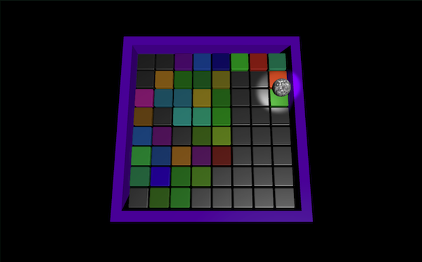

## You will make

Create a tiled disco dance floor. Tilt the floor to roll a mirror ball over the tiles to change their colour and play sounds.

You will:

+ Create a skybox material and add it to the scene
+ Create a level that you can tilt to move a ball around
+ Add a spotlight and amend the directional light to create different lighting effects
+ Apply sounds and random colours to an object on collision

--- no-print ---

Control the rotation of the dance floor using <kbd>WASD</kbd> (or <kbd>ZQSD</kbd>) or the arrow keys. See and hear what happens when you the ball rolls over a tile.  

<iframe allowtransparency="true" width="710" height="500" src="https://disco-dance-floor-basic-example.rpfilt.repl.co" frameborder="0" scrolling="no"></iframe>

--- /no-print ---

--- print-only ---

--- /print-only ---

### You will need

This project requires the Unity Editor, which can be installed from the Unity Hub. This is a large download and install, so we recommend you install it before starting this project.

You can follow our [Unity guide](https://projects.raspberrypi.org/en/projects/unity-guide){:target="_blank"} to install Unity Hub and the Unity Editor for your operating system.

You will also need to download the [Unity starter package](https://rpf.io/p/en/rainbow-run-go){:target="_blank"} of assets before starting.

