## Build the disco floor

In this step you will build the disco dance floor for your project. 

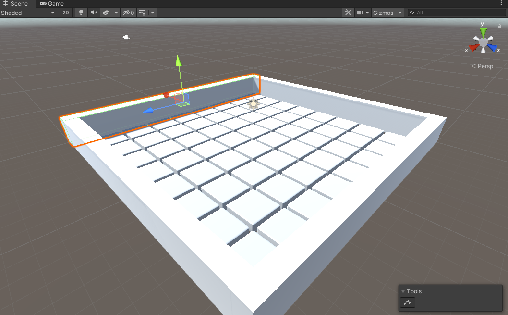{:width="350px"}

### Create a project with the starter package

--- task ---

Launch the Unity Hub and click **Projects** then select **New project**:

From the list choose **All templates** then select **3D Core**:

Edit the project settings to give your project a sensible name and save it to a sensible location. Then click **Create project**:

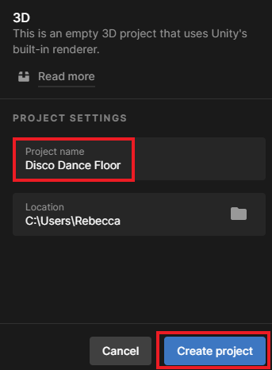

Your new project will open in the Unity Editor. It may take some time to load.

--- /task ---

--- task ---

The Unity starter package you downloaded for this More Unity path contains a number of **Assets** for you to use in your project.

To import them into your new project, click on the **Assets menu** and select **Import package > Custom Package…** then navigate to the downloaded Unity starter package.

--- collapse ---
---
title: I haven't downloaded a Unity starter package
---

Download and unzip the [More Unity starter package](https://rpf.io/p/en/rainbow-run-go){:target="_blank"} to your computer. 

**Tip:** Choose a sensible location such as your Documents folder. 

--- /collapse ---

[[[unity-importing-a-package]]]

--- /task ---

--- task ---

Right-click on **SampleScene** in the Hierarchy and choose **Save Scene As**: 

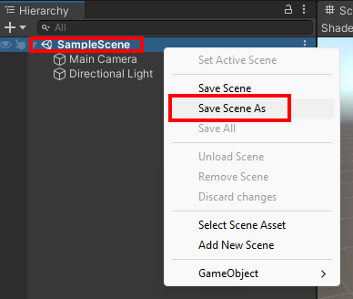

In the pop-up window, name your Scene `Disco Dance Floor`:

A new file will appear in the Assets folder in the Project window:

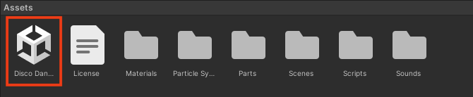

--- /task ---

### Build a floor

--- task ---

In the Project window, click on **Parts**.

**Drag** the 'Floor' object to the Scene view: 

Your scene should look like this:

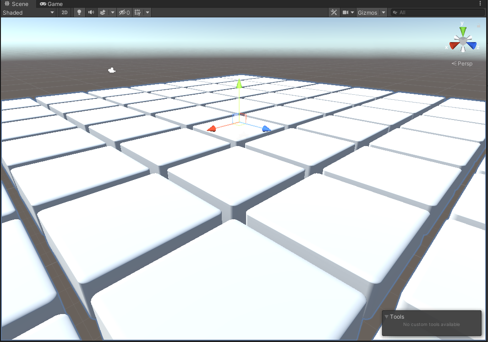

--- /task ---

--- task ---

Go to the Inspector window. Click on the Transform component menu and select 'Reset'. This will centre your floor in the world:

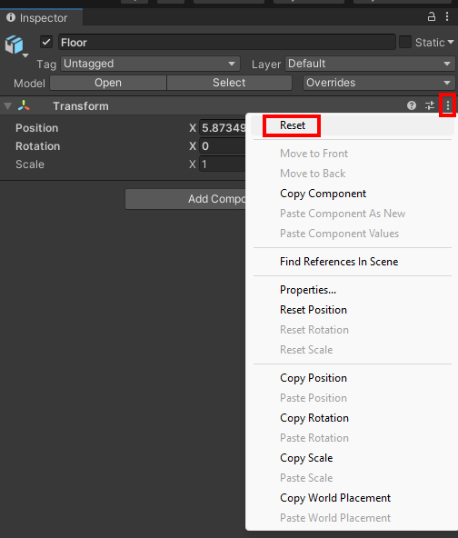

--- /task ---

--- task ---

In the Hierarchy window, right-click on the 'Floor' GameObject and select **Create Empty Parent**. 

A new parent will 'GameObject' will be created:

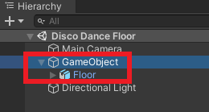

Right-click on the new gameObject and rename it to 'Dance Floor':

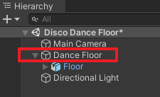

--- /task ---

--- task ---

From the Hierarchy window you can see that the 'Floor' GameObject contains 64 individually numbered cubes.

Click on the 'Cube' GameObject. Hold down the <kbd>shift</kbd> and scroll to the bottom of the list of cubes then click on 'Cube.0063'. All of the cubes will be highlighted: 

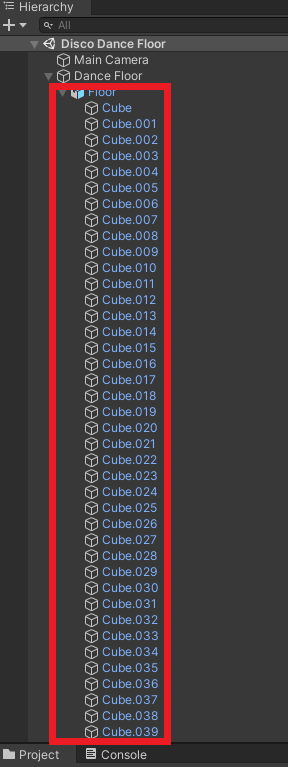

--- /task ---

--- task ---

With all the cubes selected, go to the Inspector window and click 'Add Component'. Type 'Box' into the search box then click on 'Box Collider'. This will add a box collider to each of the cubes:

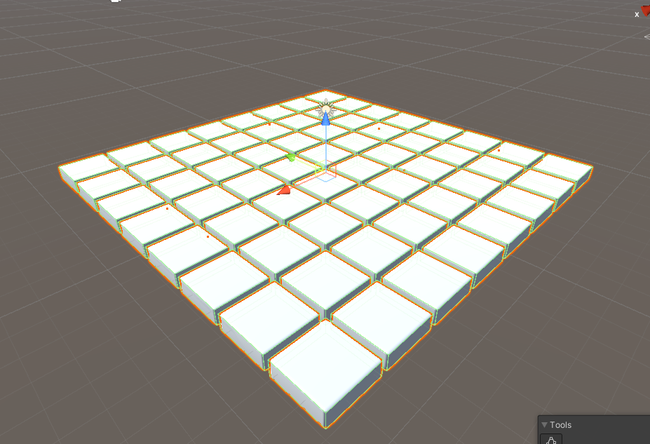

--- /task ---

### Add walls

--- task ---

Go to the Hierarchy and right-click on the 'Dance Floor' gameObject. Select **3D Object > Cube**:

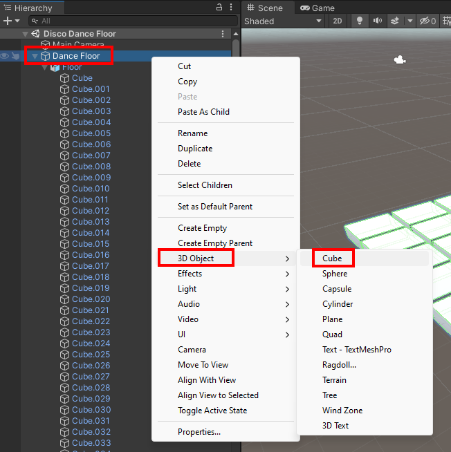

In the Inspector window, change the Transform properties of the new cube to. Position X=`9.5`, Y=`1`, Z=`0` and Scale X=`1`, Y=`2`, Z=`20`. 

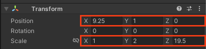

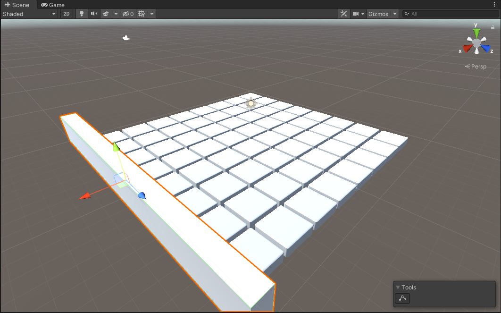

--- /task ---

--- task ---

Go to the Hierarchy and right-click on the 'Cube' gameObject. Select **Duplicate**.

In the Inspector window, change the Transform properties of the new cube to. Position X=`-9.5`.

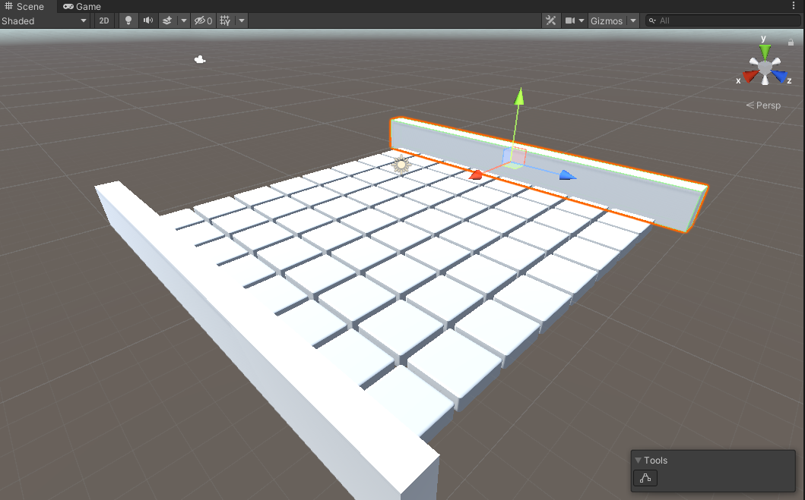

--- /task ---

--- task ---

Go to the Hierarchy and right-click on the 'Cube' gameObject again. Select **Duplicate**.

In the Inspector window, change the Transform properties of the new cube to Position X=`0`, Y=`1`, Z=`9.5` and Rotation X=`0`, Y=`90`, Z=`0`.

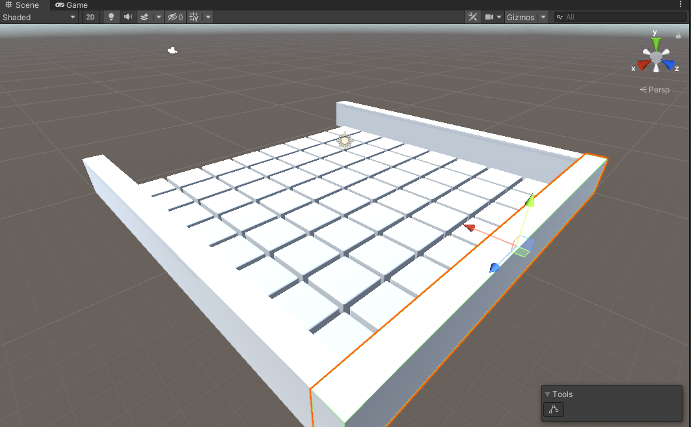

--- /task ---

--- task ---

Go to the Hierarchy and right-click on the 'Cube' gameObject again. Select **Duplicate**.

In the Inspector window, change the Transform properties of the new cube to Position Z=`-9.5`.

--- /task ---