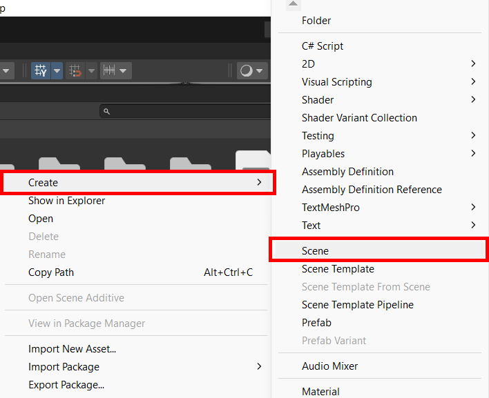
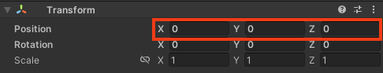
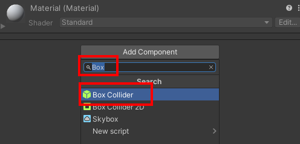

## Build the disco floor

In this step you will build the disco dance floor for your project. 

{:width="350px"}

--- task ---

Launch the Unity Hub and open the project you created for [Rainbow run](https://projects.raspberrypi.org/en/projects/rainbow-run/0){:target='_blank'}.

--- collapse ---

---
title: I haven't got my Rainbow run project
---

If you are unable to open your project, launch the Unity Hub and click **Projects** then select **New project**:

From the list choose **All templates** then select **3D Core**:

Edit the project settings to give your project a sensible name and save it to a sensible location. Then click **Create project**:

Your new project will open in the Unity Editor. It may take some time to load.

Download and unzip the [More Unity starter package](https://rpf.io/p/en/rainbow-run-go){:target="_blank"} to your computer. 

**Tip:** Choose a sensible location such as your Documents folder.

The Unity starter package you downloaded for this More Unity path contains a number of **Assets** for you to use in your project.

To import them into your new project, click on the **Assets menu** and select **Import package > Custom Package…** then navigate to the downloaded Unity starter package.

--- /collapse ---

--- /task ---

--- task ---

In the **Project** panel right-click and select **Create --> Scene**.

In the pop-up window, name your Scene `Disco Dance Floor`:

A new file will appear in the Assets folder in the Project window:

Drag the new Scene into the 'Scenes' folder to organise your files.

--- /task ---

### Build a floor

--- task ---

In the Project window, click on **Parts**.

**Drag** the '8x8Floor' object to the Scene view: 

Your scene should look like this:

--- /task ---

--- task ---

In the Inspector window, change the Transform properties of the '8x8Floor' GameObject: Position X=`0`, Y=`0`, Z=`0`.

--- /task ---

--- task ---

In the Hierarchy window, right-click on the '8x8Floor' GameObject and select **Create Empty Parent**. 

A new parent 'GameObject' will be created:

Right-click on the new GameObject and rename it to 'Dance Floor':

--- /task ---

--- task ---

From the Hierarchy window you can see that the 'Floor' GameObject contains 64 individually numbered cubes.

Click on the 'Cube' GameObject. Hold down the <kbd>shift</kbd> and scroll to the bottom of the list of cubes then click on 'Cube.0063'. All of the cubes will be highlighted: 

--- /task ---

--- task ---

With all the cubes selected, go to the Inspector window and click 'Add Component'. Type 'Box' into the search box then click on 'Box Collider'. This will add a box collider to each of the cubes:

--- /task ---

### Add walls

--- task ---

Go to the Hierarchy and right-click on the 'Dance Floor' GameObject. Select **3D Object > Cube**:

In the Inspector window, change the Transform properties of the new cube: Position X=`9.25`, Y=`1`, Z=`0` and Scale X=`1`, Y=`2`, Z=`19.5`. 

--- /task ---

--- task ---

Go to the Hierarchy and right-click on the 'Cube' GameObject. Select **Duplicate**.

In the Inspector window, change the Transform properties of the new cube to. Position X=`-9.25`.

--- /task ---

--- task ---

Go to the Hierarchy and right-click on the original 'Cube' GameObject again. Select **Duplicate**.

In the Inspector window, change the Transform properties of the new cube to Position X=`0`, Y=`1`, Z=`9.25` and Rotation X=`0`, Y=`90`, Z=`0`.

--- /task ---

--- task ---

Go to the Hierarchy and right-click on the 'Cube (2)' GameObject you just rotated. Select **Duplicate**.

In the Inspector window, change the Transform properties of the new cube to Position Z=`-9.25`.

--- /task ---