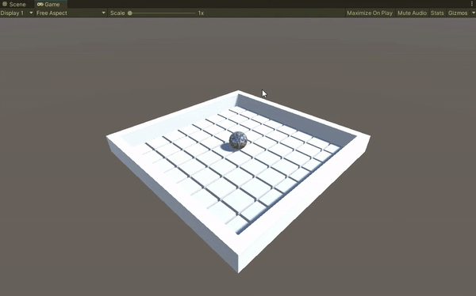
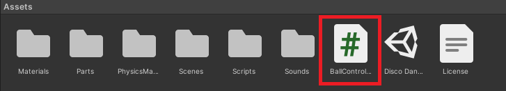
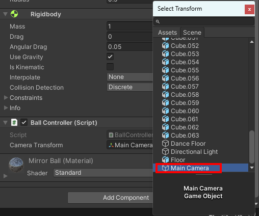

## Roll a mirror ball

In this step you will create a mirror ball and add a script to roll the mirror ball around the disco dance floor. 

{:width="350px"}

### Set the camera view

--- task ---

Click on the **View tool** in the Scene view (the hand icon) and drag the view until you are happy with the view of the dance floor. Right-click on the Main Camera object in the Hierarchy window and select 'Align With View':

[[[unity-scene-navigation]]]

--- collapse ---
---
title: Alternatively, enter transform numbers to move the camera
---

Select the 'Main Camera' in the hierarchy window and change the position and rotate properties to match the following:

Position X=`-16`, Y=`15`, Z=`-16` and Rotate X=`35`, Y=`45`, Z=`1`. 

Right-click on the 'Main Camera' and choose 'Align View to Selected' to match the scene view to the new camera position. 

--- /collapse ---

--- /task ---

### Add a ball

--- task ---

Go to the 'Hierarchy' window and right-click to create a new Sphere GameObject. 

**Rename** the sphere 'Ball'.

--- /task ---

--- task ---

Change the position and scale of the 'Ball' to:

Position X=`1`, Y=`1.5`, Z=`1` and Scale X=`2`, Y=`2`, Z=`2`. 

--- /task ---

--- task ---

Make sure that the 'Ball' is selected in the 'Hierarchy'. Go to the 'Inspector Window' and choose 'Add Component'.

Type in 'Rigid' and select the 'Rigidbody' component to add it to the ball. This allows the ball to work with gravity. 

--- /task ---

--- task ---

In the Inspector Window click the dropdown next to 'Tag' and add the 'Player' tag to the Ball GameObject.

--- /task ---

--- task ---

Go to the 'Project window' and navigate to 'Assets' -> 'Materials'.

Drag the 'MirrorBall' material onto the 'Ball' GameObject in the Scene View.

--- /task ---

--- task ---

With the 'Ball' selected. Press <kbd>Shift</kbd> + <kbd>F</kbd> to shift focus to the 'Ball'.

--- /task ---

### Move the ball

--- task ---

Go to the hierarchy window and select the 'Ball' GameObject. In the Inspector, click 'Add Component' and type `BallController`. 

Select the BallController Script.

--- collapse ---

---
title: I don't have a BallController script
---

Create a new script called `BallController` by clicking 'New script' and then 'Create and Add':

Go to the Project window. The new 'BallController' script will be saved in the Assets folder. Drag the new script to the ‘Scripts’ folder to organise your files.

Double click on the ‘BallController’ script. The script will open in a separate code editor.

Copy or type this code to make the ball move:

--- code ---
---
language: cs
filename: BallController.cs
line_numbers: true
line_number_start: 1
line_highlights: 
---

using System.Collections;
using System.Collections.Generic;
using UnityEngine;

public class BallController : MonoBehaviour
{
    private Rigidbody rb;
    public Transform cameraTransform;
    public string rightKey;
    public string leftKey;
    public string upKey;
    public string downKey;
    
    // Start is called before the first frame update
    void Start()
    {
        rb = GetComponent<Rigidbody>();
        rb.transform.forward = cameraTransform.forward;
    }

    // Update is called once per frame
    void FixedUpdate()
    {
        Vector3 forward = new Vector3(cameraTransform.forward.x, 0, cameraTransform.forward.z).normalized;
        Vector3 right = Quaternion.AngleAxis(90, Vector3.up) * forward;
        Vector3 left = -right;
        Vector3 backward = -forward;

        if (Input.GetKey(rightKey))
        {
            rb.AddForce(right * 5f);
        }

        if (Input.GetKey(leftKey))
        {
            rb.AddForce(left * 5f);
        }

        if (Input.GetKey(upKey))
        {
            rb.AddForce(forward * 10f);
        }

        if (Input.GetKey(downKey))
        {
            rb.AddForce(backward * 2f);
        }
    }
}

--- /code ---

Save your script and switch back to the Unity editor.

--- /collapse ---

--- /task ---

--- task ---

Save your script and switch back to the Unity Editor and click on the 'Ball' GameObject in the Hierarchy window.

Find the 'Camera Transform' property of the Ball's BallController script in the Inspector window.

Click on the circle to the right of the Camera Transform property and choose the 'Main Camera' GameObject:

Set the key variables to whichever keys you want to use to control your ball:

--- collapse ---
---
title: I want to use different keys
---

If you want to know the naming conventions to use for the other keys on your keyboard then you can visit the [Unity Documentation](https://docs.unity3d.com/Manual/class-InputManager.html){:target="_blank"}.

You can enter the names into the Inspector.

--- /collapse ---

--- /task ---

--- task ---

**Test:** Select the Game view tab and click on the 'Play' button to run your project.  

Use the keys you set in the Inspector to move the ball across the floor: 

Press the 'Play' button again to stop running your project. 

--- /task ---