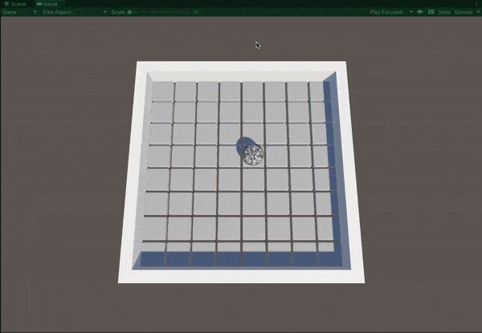
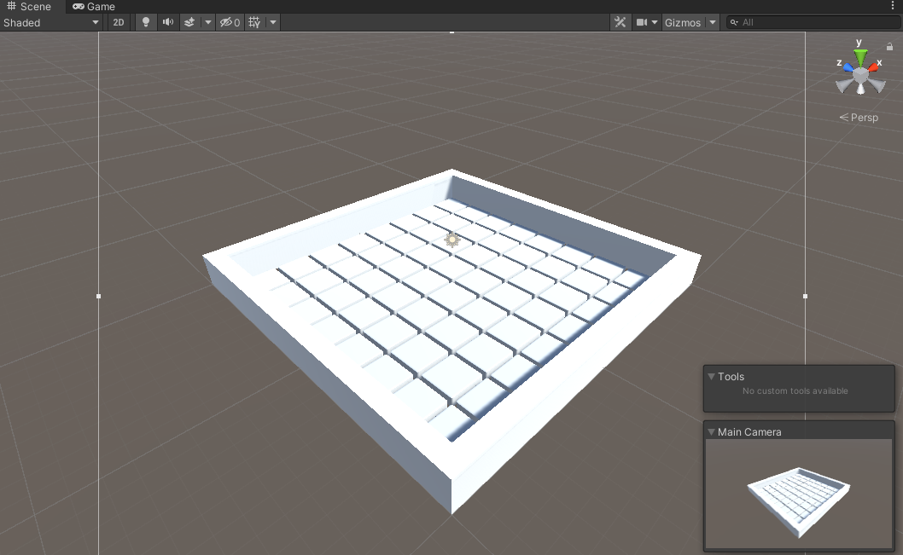
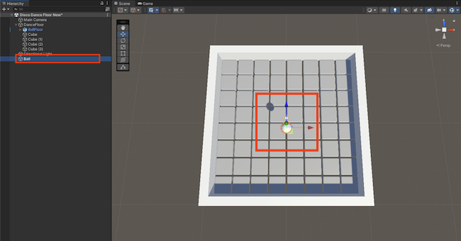
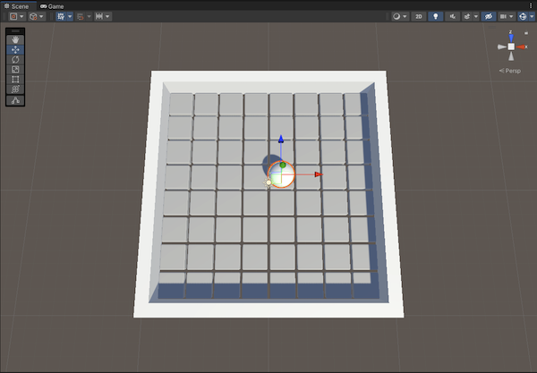
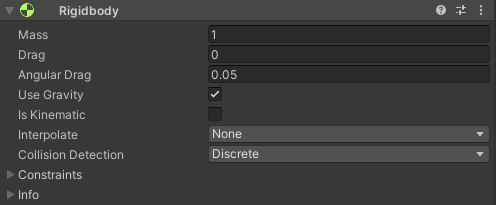
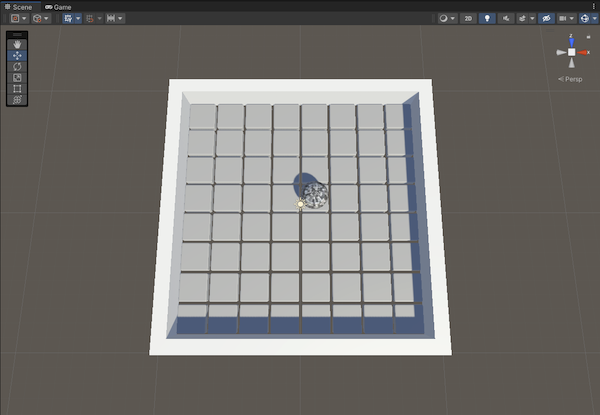
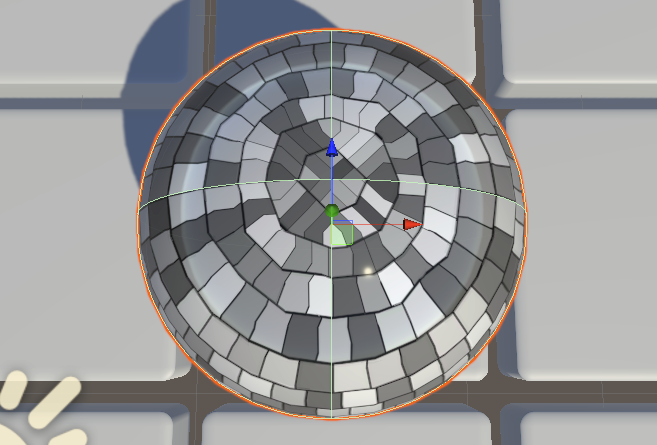

## Roll a mirror ball

In this step, you will create a mirror ball and add a script to roll the mirror ball around the disco dance floor. 

{:width="350px"}

Tilting games and puzzles have been around for a long time. One of the first examples is called **Labyrinth**, which was released in Sweden in **1946**.

### Set the camera view

--- task ---

Select the 'Main Camera' in the hierarchy window and change the position and rotate properties to match the following:

Position X=`0`, Y=`25`, Z=`-5` and Rotate X=`80`, Y=`0`, Z=`0`. 

Right-click on the 'Main Camera' and choose 'Align View to Selected' to match the scene view to the new camera position.

--- /task ---

### Add a ball

--- task ---

Go to the Hierarchy window and right-click to create a new 'Sphere' GameObject. 

**Rename** the sphere 'Ball'.

--- /task ---

--- task ---

Change the position and scale of the 'Ball' to:

Position X=`1`, Y=`1.5`, Z=`1` and Scale X=`2`, Y=`2`, Z=`2`. 

--- /task ---

--- task ---

Make sure that the ball is selected in the Hierarchy. Go to the Inspector window and choose 'Add Component'.

Type in 'Rigid' and select the 'Rigidbody' component to add it to the ball. This allows the ball to work with gravity. 

--- /task ---

--- task ---

In the Inspector window, click the dropdown next to 'Tag' and add the 'Player' tag to the 'Ball' GameObject.

--- /task ---

--- task ---

Go to the Project window and navigate to **Assets > Materials**.

Drag the 'MirrorBall' material onto the 'Ball' GameObject in the Scene view.

--- /task ---

--- task ---

With the 'Ball' selected. Press <kbd>Shift</kbd> + <kbd>F</kbd> to shift focus to the 'Ball'.

--- /task ---

### Tilt the dance floor

--- task ---

Go to the Hierarchy window and select the 'Ball' GameObject. In the Inspector, click 'Add Component' and type `FloorTilt`.

Click 'New script' and then 'Create and Add' to create the script. 

The new script will be saved in your Assets folder. Drag it to the Scripts folder to organise your files.

--- /task ---

--- task ---

Open **FloorTilt** in your code editor. 

Type out or copy and paste the following code into the script.

--- code ---
---
language: cs
filename: FloorTilt.cs
line_numbers: true
line_number_start: 1
line_highlights: 
---

using System.Collections;
using System.Collections.Generic;
using UnityEngine;

public class FloorTilt : MonoBehaviour
{
    public float maxTilt;
    public float turnSpeed;

    public string forwardKey;
    public string leftKey;
    public string backwardKey;
    public string rightKey;

    // Update is called once per frame
    void Update()
    {
        float targetXRotation = 0;

        if (Input.GetKey(forwardKey))
        {
            targetXRotation += maxTilt;
        }

        if (Input.GetKey(backwardKey))
        {
            targetXRotation += 360 - maxTilt;
        }

        float targetZRotation = 0;

        if (Input.GetKey(rightKey))
        {
            targetZRotation += 360 - maxTilt;
        }

        if (Input.GetKey(leftKey))
        {
            targetZRotation += maxTilt;
        }

        Quaternion targetRotation = Quaternion.Euler(targetXRotation, 0, targetZRotation);

        transform.rotation = Quaternion.Lerp(transform.rotation, targetRotation, turnSpeed * Time.deltaTime);
    }
}

--- /code ---

--- collapse ---

---
title: What is Lerp?
---

Lerp is used in Unity to transition between two `Vectors` or `Quaternions` (rotations). 

This method will return a value in between the two Vectors or Quaternions you provide. 

In this case, the GameObject will rotate from it's current rotation (`transform.rotation`) towards the `targetRotation` you have set with the key presses.

When you let go of the keys, the floor will slowly move back to its starting rotation.

--- /collapse ---

--- /task ---

--- task ---

Save your script and switch back to the Unity Editor. Click on the 'Dance Floor' GameObject in the Hierarchy window.

Find the 'FloorTilt' component and set 'Max Tilt' to `25` and 'Turn Speed' to `1`. 

--- collapse ---

---
title: What do these variables do?
---

The `maxTilt` variable is used to control how **far** the world will be rotated. You can make this larger if you want more rotation and smaller if you want less.

The `turnSpeed` variable controls how fast the world rotates. If you make it larger, the floor will rotate faster. Be careful not to make it too fast otherwise the `Ball` might fly off your dance floor!

--- /collapse ---

**Choose:** Set the keys you would like to use for tilting your world. We have used the <kbd>WASD</kbd> layout.

--- collapse ---
---
title: I want to use different keys
---

You can set whichever keys you would like to use in the Inspector. For letter keys, just make sure the letters are **lower case**. 

You can also use the arrows by entering `up` and `down` into the Inspector.

If you want to know the naming conventions to use for the other keys on your keyboard, you can visit the [Unity Documentation](https://docs.unity3d.com/Manual/class-InputManager.html){:target="_blank"}.

--- /collapse ---

.

--- /task ---

--- task ---

**Test:** Select the Game view tab and click on the 'Play' button to run your project.  

Use the keys you set in the Inspector to move the ball across the floor: 

Press the 'Play' button again to stop running your project. 

--- /task ---