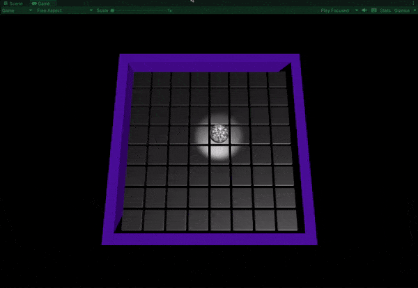
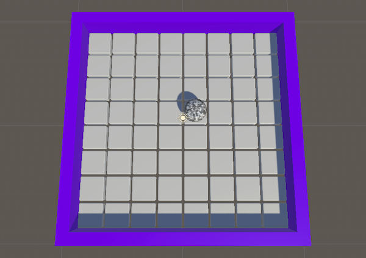
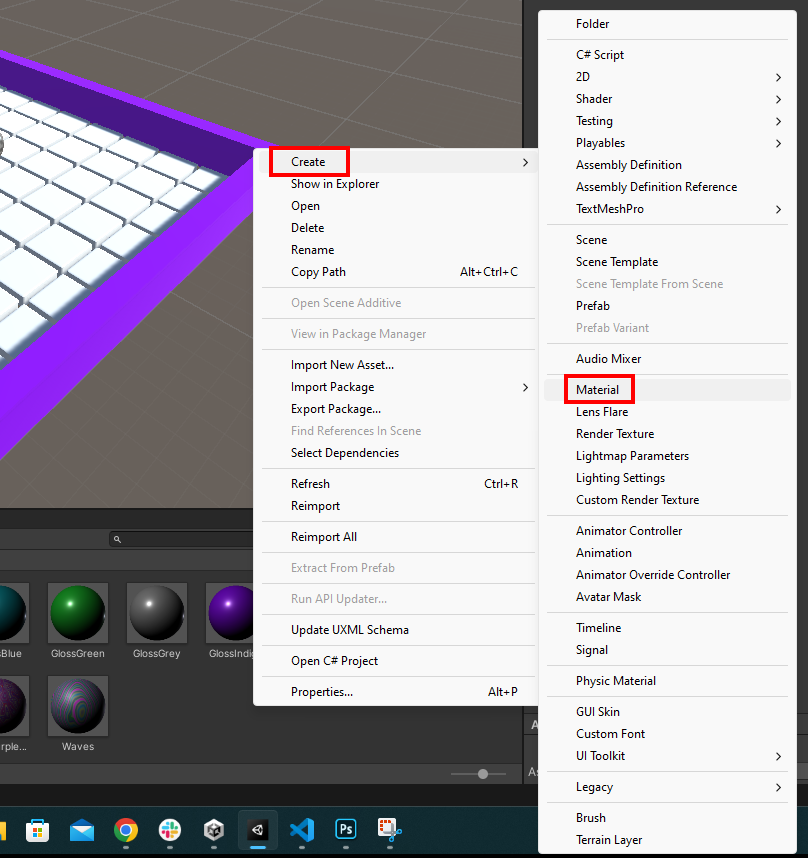
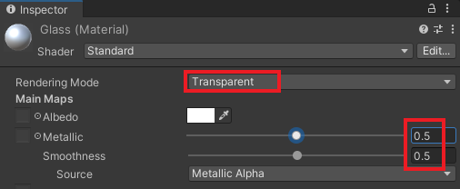
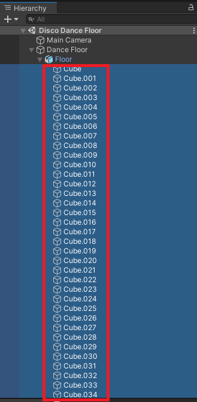
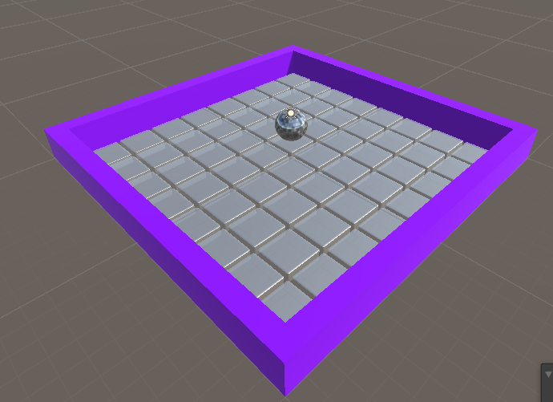
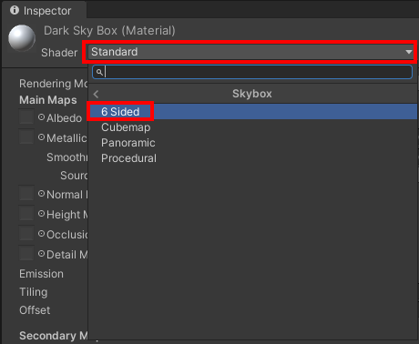
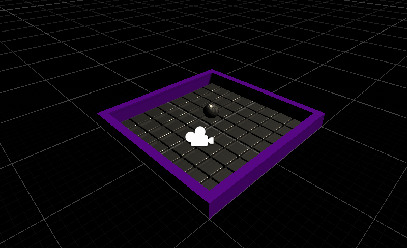
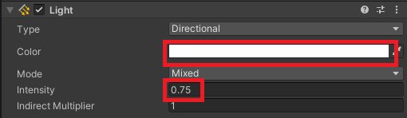
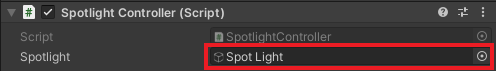

## Dim the lights

In this step you will dim the lights in your disco dance floor scene and add a spotlight that follows your mirror ball. 

{:width="350px"}

### Add a glass material to the dance floor

--- task ---

Go to the 'Project' window and navigate to 'Assets' -> 'Materials'. 

**Choose** a material for your walls and drag it onto each wall. This example uses 'GlossIndigo'.

--- /task ---

--- task ---

In the 'Project' window. Make sure that you are still inside the 'Materials' folder.

Right-click and select 'Create' -> 'Material'. Name the new material 'Glass'.

--- /task ---

--- task ---

With the 'Glass' material selected. Go to the 'Inspector' window.

Change the 'Rendering Mode' to 'Transparent'.

Set 'Metallic' to `0.5` and set 'Smoothness' to `0.5`.

--- /task ---

--- task ---

Click on the white paint sample next to 'Albedo' and set the 'Alpha' channel to `0`.

--- /task ---

--- task ---

In the 'Hierarchy' window. Expand the Floor GameObject and highlight all of the cubes.

--- /task ---

--- task ---

Drag the 'Glass' material that you just created to the 'Inspector' window below 'Add Component'.

This will apply the 'Glass' material to all of your tiles.

--- /task ---

### Add a black Skybox to your scene

--- task ---

In the 'Materials' folder in the 'Project' window, add a new material named 'DarkSkybox'.

--- /task ---

--- task ---

With the new 'DarkSkybox' material selected. Go to the 'Inspector' window.

Change the 'Shader' to 'Skybox -> 6 Sided'.

--- /task ---

--- task ---

Change the 'Tint Color' to black by moving the R, G, B sliders down to `0`. 

--- /task ---

--- task ---

Drag the new 'DarkSkybox' from the 'Materials' folder onto the background of your scene. 

Your scene will become very dark!

--- /task ---

### Change the directional light

--- task ---

In the 'Hierarchy' window. Select the 'Directional Light' GameObject.

--- /task ---

--- task ---

Go to the 'Inspector' window and change the 'Color' to white and the 'Intensity' to `0.75`.

**Tip:** To change the colour to white your can move the 'R, G, B' sliders to `255`.

--- /task ---

### Add a spotlight

--- task ---

In the 'Hierarchy' window, right-click and go to 'Light' -> 'Spotlight' to create a new spotlight GameObject.

--- /task ---

--- task ---

With the 'Spot Light' selected, go to the 'Inspector' window.

Change the transform position to X = `1.5`, Y=`7`, Z=`1.5` to move the spotlight above your mirror ball.

--- /task ---

--- task ---

Staying in the 'Inspector' window. Change the following settings:

+ Range: `30`
+ Spot Angle: `48`
+ Intensity: `2`
+ Shadow Type: Soft Shadows
+ Normal bias: `0.4`
+ Near plane: `0.1`
+ Render mode: Important

--- /task ---

--- task ---
**Test:** 'Play' your project to see the spotlight over the ball. Use the keys to move the ball. The spotlight will stay in the same position. 

--- /task ---

### Make the spotlight follow the ball

--- task ---

Go to the 'Hierarchy' window and select the **Ball** GameObject.

In the 'Inspector' window, go to 'Add Component' and search for 'Script' and choose 'NewScript'.

Name the new script 'SpotlightController' and drag it into the 'Scripts' folder.

--- /task ---

--- task ---

Double-click on the 'SpotlightController' script to open it and enter the following code:

--- code ---
---
language: cs
filename: SpotlightController.cs
line_numbers: true
line_number_start: 1
line_highlights: 
---
using System.Collections;
using System.Collections.Generic;
using UnityEngine;
public class SpotlightController : MonoBehaviour
{
    public GameObject Spotlight;
    Vector3 spotOffset;

    // Start is called before the first frame update
    void Start()
    {
        spotOffset = Spotlight.transform.position - this.transform.position;
    }

    // Update is called once per frame
    void Update()
    {
        Spotlight.transform.position = this.transform.position + spotOffset;
    }
}

--- /code ---

**Save** and return to Unity.

--- /task ---

--- task ---

Select the 'Ball' GameObject in the 'Hierarchy' window. 

The Spotlight Controller script needs to know which Spotlight it should use.

Drag the 'Spot Light' GameObject to the Spotlight variable in the 'Inspector' window.

--- /task ---

--- task ---

**Test** your code by running your project. The spotlight should follow the mirror ball.

**Debug** Make sure the 'SpotlightController' script is on the 'Ball' GameObject. The 'Ball' controls the position of the spotlight. 

--- /task ---

