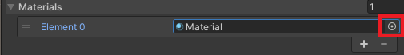

## Dim the lights

In this step you will dim the lights in your disco dance floor scene and add a spotlight that follows your mirror ball. 

{:width="350px"}

### Add a glass material to the dance floor

--- task ---

Go to the 'Project' window and navigate to 'Assets' -> 'Materials'. 

**Choose** a material for your walls and drag it onto each wall. This example uses 'GlossIndigo'.

--- /task ---

--- task ---

In the 'Project' window. Make sure that you are still inside the 'Materials' folder.

Right-click and select 'Create' -> 'Material'. Name the new material 'Glass'.

--- /task ---

--- task ---

With the 'Glass' material selected. Go to the 'Inspector' window.

Change the 'Rendering Mode' to 'Transparent'.

Set 'Metallic' to `0.5` and set 'Smoothness' to `0.5`.

--- /task ---

--- task ---

Click on the white paint sample next to 'Albedo' and set the 'Alpha' channel to `0`.

--- /task ---

--- task ---

In the 'Hierarchy' window. Expand the Floor GameObject and highlight all of the cubes.

--- /task ---

--- task ---

Go to the 'Inspector' window. Expand the 'Materials' section and click on the small circle to the right of 'Material'.

--- /task ---

--- task ---

Search for the 'Glass' material that you just created and select it.

This will apply the 'Glass' material to all of your tiles.

--- /task ---

### Add a black Skybox to your scene

--- task ---

In the 'Materials' folder in the 'Project' window, add a new material named 'DarkSkybox'.

--- /task ---

--- task ---

With the new 'DarkSkybox' material selected. Go to the 'Inspector' window.

Change the 'Shader' to 'Skybox -> 6 Sided'.

--- /task ---

--- task ---

Change the 'Tint Color' to black by moving the R, G, B sliders down to `0`. 

--- /task ---

--- task ---

Drag the new 'DarkSkybox' from the 'Materials' folder onto the background of your scene. 

Your scene will become very dark!

--- /task ---

### Change the directional light

--- task ---

In the 'Hierarchy' window. Select the 'Directional Light' GameObject.

--- /task ---

--- task ---

Go to the 'Inspector' window and change the 'Color' to white and the 'Intensity' to `0.75`.

**Tip:** To change the colour to white your can move the 'R, G, B' sliders to `255`.

--- /task ---

### Add a spotlight

--- task ---

In the 'Hierarchy' window, right-click and go to 'Light' -> 'Spotlight' to create a new spotlight GameObject.

--- /task ---

--- task ---

With the Spotlight selected, go to the 'Inspector' window.

Change the transform position to X = `1.5`, Y=`7`, Z=`1.5` to move the spotlight above your mirror ball.

--- /task ---

--- task ---

Staying in the 'Inspector' window. Change the following settings:

+ Range: `30`
+ Spot Angle: `48`
+ Intensity: `2`
+ Shadow Type: Soft Shadows
+ Normal bias: `0.4`
+ Near plane: `0.1`
+ Render mode: Important

--- /task ---

