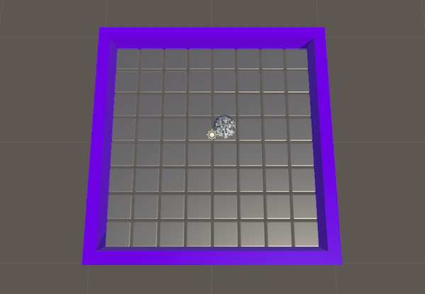

## Dim the lights

In this step, you will dim the lights in your disco dance floor scene and add a spotlight that follows your mirror ball. 

{:width="350px"}

The **Disco** movement emerged in the 1970s in America. The music and style is a mix of bright colours and technical imagery — perfect for a Unity project!

### Add a glass material to the dance floor

--- task ---

Go to the Project window and navigate to **Assets > Materials**. 

**Choose** a material for your walls and drag it onto each wall. This example uses 'GlossIndigo'.

--- /task ---

--- task ---

In the Project window. Make sure that you are still inside the Materials folder.

Right-click and select **Create > Material**. Name the new material `Glass`.

--- /task ---

--- task ---

With the **Glass** material selected. Go to the Inspector window.

Change the 'Rendering Mode' to 'Transparent'.

Set 'Metallic' to `0.5`.

--- /task ---

--- task ---

Click on the white paint sample next to 'Albedo' and set the 'Alpha' channel to `0`.

--- /task ---

--- task ---

In the Hierarchy window, expand the 'Floor' GameObject and highlight all of the cubes.

--- /task ---

--- task ---

Drag the 'Glass' material that you just created to the Inspector window below 'Add Component'.

This will apply the 'Glass' material to all of your tiles.

--- /task ---

### Add a black Skybox to your scene

--- task ---

In the Materials folder in the Project window, create a new material named 'DarkSkyBox'.

--- /task ---

--- task ---
With the new 'DarkSkyBox' material selected, go to the Inspector window.

Change the 'Shader' to 'Skybox -> 6 Sided'.

--- /task ---

--- task ---

Change the 'Tint Color' to black by moving the R, G, B sliders down to `0`. 

--- /task ---

--- task ---

Drag the new 'DarkSkBox' from the 'Materials' folder onto the background of your scene. 

Your scene will become very dark!

--- /task ---

### Change the directional light

--- task ---

In the Hierarchy window, select the 'Directional Light' GameObject.

--- /task ---

--- task ---

Go to the Inspector window and change the 'Color' to white and the 'Intensity' to `0.75`.

**Tip:** To change the colour to white, you can move the 'R, G, B' sliders to `255`.

--- /task ---

### Add a spotlight

--- task ---

In the Hierarchy window, right-click and go to **Light > Spotlight** to create a new 'Spotlight' GameObject.

--- /task ---

--- task ---

With the 'Spotlight' selected, go to the Inspector window.

Change the Transform position to X = `1`, Y=`7`, Z=`1` to move the spotlight above your mirror ball.

--- /task ---

--- task ---

Staying in the Inspector window. Change the following settings:

+ Range: `20`
+ Spot Angle: `48`
+ Intensity: `1.5`
+ Shadow Type: Soft Shadows
+ Render mode: Important

--- /task ---

--- task ---

**Test:** 'Play' your project to see the spotlight over the ball. Use the keys to move the ball. The spotlight will stay in the same position.
 
Press the 'Play' button again to stop running your project. 

--- /task ---

### Make the spotlight follow the ball

--- task ---

Go to the Hierarchy window and select the 'Ball' GameObject.

In the Inspector window, go to 'Add Component' and search for 'Script' and choose 'New script'.

Name the new script 'SpotlightController' and drag it into the Scripts folder.

--- /task ---

--- task ---

Double-click on the 'SpotlightController' script to open it and enter the following code:

--- code ---
---
language: cs
filename: SpotlightController.cs
line_numbers: true
line_number_start: 1
line_highlights: 
---
using System.Collections;
using System.Collections.Generic;
using UnityEngine;
public class SpotlightController : MonoBehaviour
{
    public GameObject Spotlight;
    Vector3 spotOffset;

    // Start is called before the first frame update
    void Start()
    {
        spotOffset = Spotlight.transform.position - this.transform.position;
    }

    // Update is called once per frame
    void Update()
    {
        Spotlight.transform.position = this.transform.position + spotOffset;
    }
}

--- /code ---

**Save** and return to Unity.

--- /task ---

--- task ---

Select the 'Ball' GameObject in the Hierarchy window. 

The 'SpotlightController' script needs to know which Spotlight it should use.

Drag the 'Spotlight' GameObject to the Spotlight variable in the Inspector window.

--- /task ---

--- task ---

**Test** your code by running your project. The spotlight should follow the mirror ball.

**Debug** Make sure the 'SpotlightController' script is on the 'Ball' GameObject. The 'Ball' controls the position of the spotlight. 

--- /task ---

