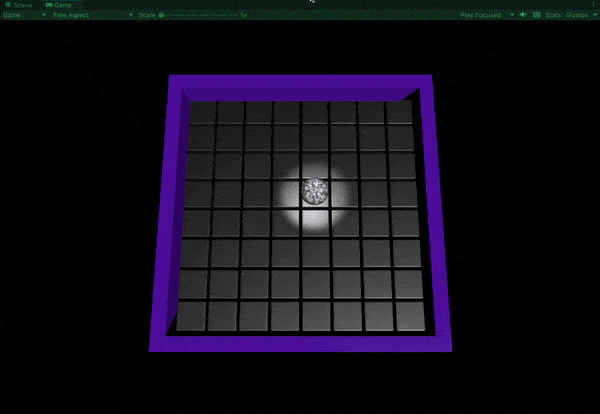
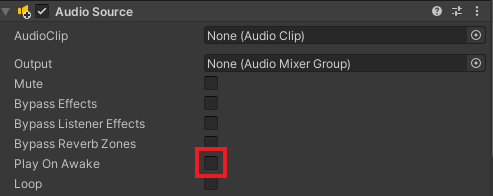
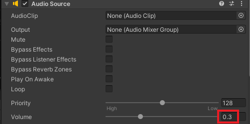
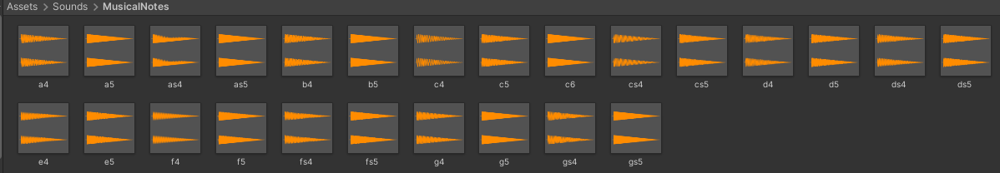

## Add random colours and sounds

In this step you will add code to your script that will change the tile to a random colour and play a musical note when it is rolled over by the mirror ball. 

<video width="640" height="360" controls preload="none" poster="images/add-sound.png">
<source src="images/tile-sounds.mp4" type="video/mp4">
Your browser does not support WebM video, try FireFox or Chrome
</video>

### Add random colours to the tiles

--- task ---

In the Hierarchy window, expand the 'Dance Floor' then 'Floor' GameObjects. Select all of the cubes.

**Tip:** Hold down the shift and scroll to the bottom of the list of cubes then click on ‘Cube.0063’. All of the cubes will be highlighted:

--- /task ---

--- task ---

Click 'Add Component' and create a new script called 'RandomColour'.

In the 'Project' window drag 'RandomColour' to the 'Scripts' folder.

Double-click on the 'RandomColour' Script. Add an 'OnCollisionEnter' function to change the colour of a tile when the ball rolls over it:

--- code ---
---
language: cs
filename: RandomColour.cs
line_numbers: true
line_number_start: 1
line_highlights:
---
using System.Collections;
using System.Collections.Generic;
using UnityEngine;

public class RandomColour : MonoBehaviour
{
    // Start is called before the first frame update
    void Start()
    {
        
    }

    // Update is called once per frame
    void Update()
    {
        
    }

    void OnCollisionEnter(Collision other) 
    {
        if (other.gameObject.CompareTag("Player"))
        {
            Color NewColor = Random.ColorHSV(0f, 1f, 1f, 1f, 0.5f, 1f);
            gameObject.transform.GetComponent<MeshRenderer>().material.color = NewColor;
        }
    }
}
--- /code ---

--- /task ---

--- task ---

**Save** your script and switch back to the Unity Editor.

**Test:** Play your project.

--- /task ---

### Add sounds to the tiles

--- task ---

Select all the Tiles again and add another new script called 'PlaySoundEffect'. 

Move the new script into the 'Scripts' folder.

--- /task ---

--- task ---

Open the 'PlaySound' script and type or copy and paste the code below:

--- code ---
---
language: cs
filename: PlaySound.cs
line_numbers: true
line_number_start: 1
line_highlights: 
---
using System.Collections;
using System.Collections.Generic;
using UnityEngine;

public class PlaySound : MonoBehaviour
{
    AudioSource audioSource;
    
    // Start is called before the first frame update
    void Start()
    {
        audioSource = GetComponent<AudioSource>();
    }

    // Check for collisions with the player
    void OnCollisionEnter(Collision other)
    {
        if (other.gameObject.CompareTag("Player"))
        {
            audioSource.Play();
        }
    }
}

--- /code ---

--- /task ---

--- task ---

Save your script and switch back to the Unity Editor.

In the Hierarchy window, highlight all the cubes. Go to the Inspector window and click 'Add Component'. Add the **Audio Source** component. Untick 'Play On Awake':

--- /task ---

--- task ---

With the cubes still all selected, find the 'Volume' property in the **Audio Source** component. Set the volume to `0.3`:

--- /task ---

--- task ---

In the Project window open **Sounds > MusicalNotes**. There are 25 different musical notes in this folder:

--- /task ---

--- task ---

Go to the Hierarchy window and click on the first cube 'Cube' inside the 'Floor' GameObject. 

In the Inspector window, find 'AudioClip'.  Drag a note from the Project window to the 'AudioClip' property. 

<video width="640" height="360" controls preload="none" poster="images/add-sound.png">
<source src="images/add-sound.mp4" type="video/mp4">
Your browser does not support WebM video, try FireFox or Chrome
</video>

--- /task ---

--- task ---

**Choose:** Select the next cube and drag a note to the 'AudioClip' property. Repeat for each cube.

**Tip:** Hold down the <kbd>Ctrl/Cmd</kbd> key and select multiple cubes from the Hierarchy or Scene view to add the note to more than one tile at a time.

--- /task ---

--- task ---

**Test:** Play your project. 

<video width="640" height="360" controls preload="none" poster="images/tile-sound.png">
<source src="images/tile-sounds.mp4" type="video/mp4">
Your browser does not support WebM video, try FireFox or Chrome
</video>

--- /task ---
